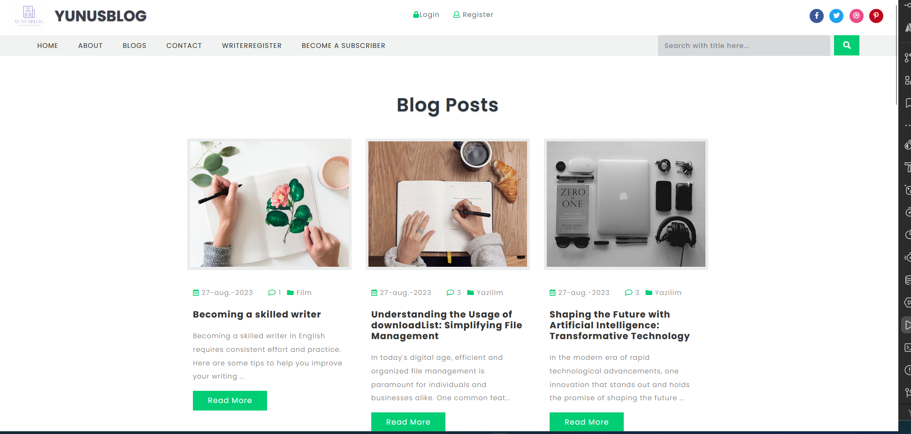
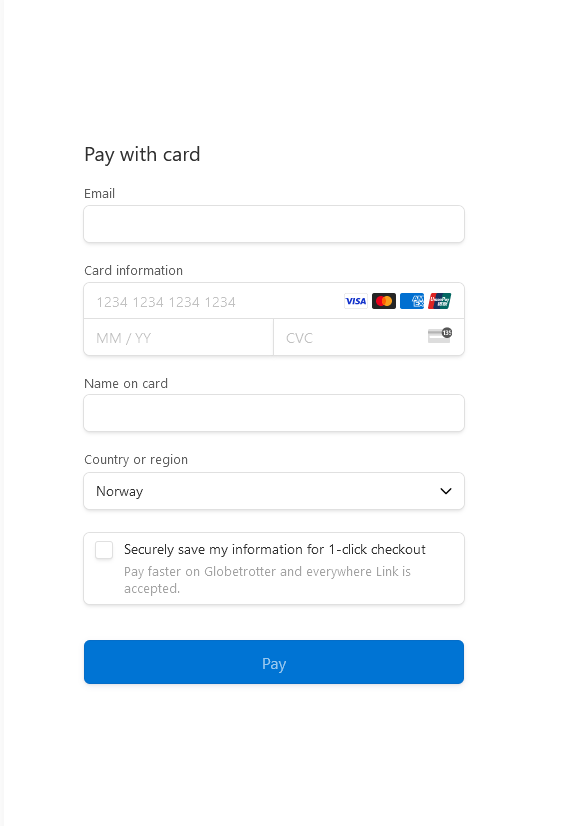
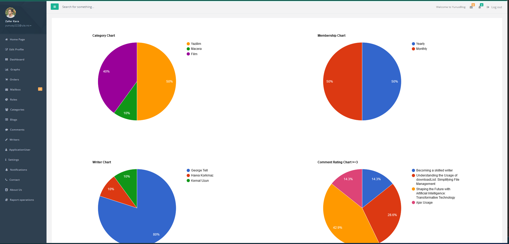
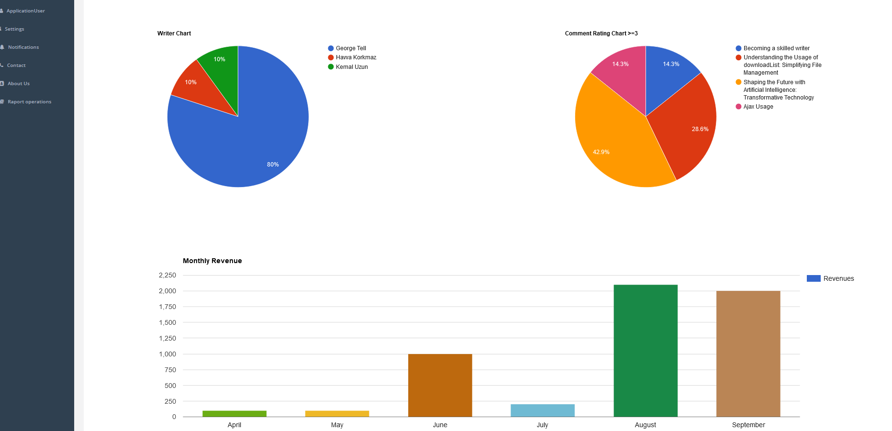
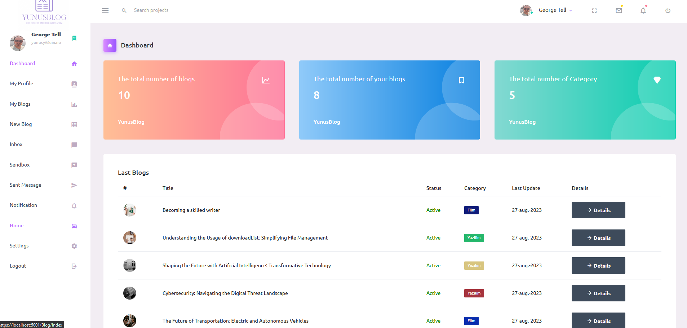
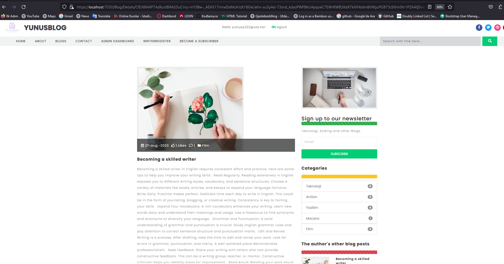

# YunusBlog
# Blog Project

{Blog Project}
{A web application for blogging, built using .NET 6.0. Entity Framework Core, N-Tier architecture, Repository Pattern}
{2023}

## Technologies Used

This project utilizes the following technologies:

- .NET 6.0: The project is built on the .NET 6.0 framework.
- ASP.NET Core MVC: It is used to create the web-based blogging platform.
- SQL Server: The application uses SQL Server as its database system.

## Features

- **User Authentication:** Users can create accounts, log in, and manage their profiles.
- **Blog Articles:** Writers can add, edit, and delete blog articles.
- **Comment System:** An interactive comment system is implemented for user engagement and feedback.
- **Admin Dashboard:** Administrators have access to a dedicated dashboard for managing user accounts, articles, and website settings.
- **Writer Dashboard:** Writers have access to a dashboard where they can create, edit, and publish articles.
- **Subscription-Based Access:** Blog article details are accessible to users with active monthly or annual subscriptions. Non-subscribers can view article previews but require a subscription for full access.
- **Google Charts:** Google Charts is used for visualizing sales statistics.
- **Stripe Integration:** Secure payment processing is integrated using Stripe.
- **Data Protection:** Measures for data protection have been implemented.
- **IP Control:** IP control is implemented with both whitelist and blacklist functionality.
- **Security Measures:** Security measures, including protection against Cross-Site Request Forgery (CSRF) attacks with Anti-Forgery tokens, are in place.
- **N-Tier Architecture:** An N-Tier architecture is used for a scalable and maintainable design.
- **API Testing and Documentation:** API testing and documentation are conducted using Postman and Swagger.
- **Source Code and Documentation:** The project's source code and documentation are available on GitHub: [GitHub Project Page](https://github.com/yunusy78/YunusBlog.git)

## Installation

To set up this project locally, follow these steps:

1. Clone the project: `git clone https://github.com/yunusy78/YunusBlog.git)`
2. Navigate to the project folder: `cd blog`
3. Restore project dependencies: `dotnet restore`
4. Configure the database connection in the `appsettings.json` file.
5. Run database migrations using Entity Framework Core CLI or tools like Visual Studio.
6. Start the application: `dotnet run`
7. Open your web browser and visit http://localhost:5000.

## Usage
To become a writer on this platform, follow these steps:

1. **User Registration:** Start by creating a user account on the platform.
2. **Complete Writer Application:** Once you are a registered user, you can access the Writer Application form.
   - This form is designed for users who wish to become writers and contribute articles.
   - Fill out the Writer Application form with the necessary details and submit it.
3. **Application Review:** After submission, your application will be reviewed by the platform's administrators.
   - Administrators will assess your application based on criteria such as writing skills, experience, and suitability.
4. **Writer Role Assignment:** If your application is approved, you will be assigned the writer role.
   - As a writer, you will gain access to the Writer Dashboard, where you can create, edit, and publish articles.

This multi-step process ensures that users interested in becoming writers go through an application and review process before gaining access to the writer role.

- Registration: Users can create accounts and manage their profiles.
- Blog Article Creation: Users can create and edit blog articles.
- Article Search: Visitors can search for blog articles using various filters.
- Article Details: Detailed blog article information includes content and contact details.
- Article Sharing: Users can share blog articles via social media or email.
- Responsive Design: The platform is designed to work on both desktop and mobile devices.

## Database Configuration

This project uses SQL Server as its database system.
You can configure the database connection in the `appsettings.json` file.

## License

This project is licensed under the [License Type] license. See the License File for more details.

## Image

